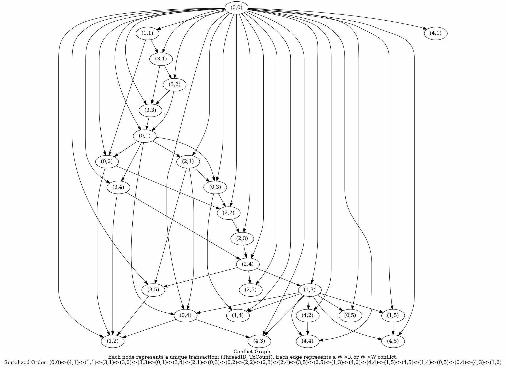

# tpcc-runner
​
An implementation of various in-memory concurrency control protocols by Riki Otaki. To evaluate in-memory concurrency control comprehensively, tpcc-runner aims to provide an Open Source C++ implementation of in-memory concurrency control protocols with full functionality (read, update, insert, delete, range scan, (blind) write, range queries).
​
# Key features
- Optimistic, Pessimistic, and Multiversion concurrency control.
- Range queries with phantom protection in all the protocols.
- YCSB and full TPC-C as benchmarks.
- Conflict graph generation to test (conflict) serializability at implementation level.
- Generic interface between benchmark and protocols, protocols and indexes.
- 100% Open-Source (MIT License)
​
# Details
​
In tpcc-runner, three protocols with two benchmarks are supported.
​
## Protocols
- SILO
  - A scalable multi-core optimistic concurrency control protocol proposed in the paper: ["Speedy Transactions in Multicore In-Memory Databases"](http://people.csail.mit.edu/stephentu/papers/silo.pdf).
- NOWAIT
  - S2PL protocol which aborts as soon as a locked record is detected.
- MVTO
  - Multiversion protocol which maintains version chains that keep versions in the timestamp order of transactions.
​
## Benchmark
- TPC-C
  -  [TPC-C](http://www.tpc.org/tpcc/) is a benchmark for online transaction processing systems used as "realistic workloads" in academia.
TPC-C executes a mix of five different concurrent transactions of different types and complexity to measure the various performances of transaction engines.
- YCSB
  - [YCSB](https://ycsb.site) is a micro-benchmark for database systems. YCSB provides six sets of core workloads (A to F) that define a basic benchmark for cloud systems. tpcc-runner supports four of them (A, B, C, F).
​

Read more about each implementation in the docs directory.
​
# Getting Started
## Dependencies
- Ubuntu 20.04
- g++ >= 10
​
## Build and Execute
### TPC-C
​
To build, SILO with TPC-C
​
```sh
mkdir build
cd build
cmake .. -DLOG_LEVEL=0 -DCMAKE_BUILD_TYPE=Release -DCC_ALG=SILO -DBENCHMARK=TPCC
make -j
```
​
After building, the executable will be stored into the `build/bin` directory.
To execute, 
​
```sh
cd build/bin
./tpcc_silo num_warehouses num_threads seconds
```
​
For example, `./tpcc_silo 2 5 20` will create tables with 2 warehouses and executes TPC-C using 5 threads for 20 seconds.
​
### YCSB
​To build SILO with YCSB
​
```sh
mkdir build
cd build
cmake .. -DLOG_LEVEL=0 -DCMAKE_BUILD_TYPE=Release -DCC_ALG=SILO -DBENCHMARK=YCSB -DPAYLOAD_SIZE=4
make -j
```
​
Note that in YCSB, an extra `-DPAYLOAD_SIZE=X` argument to determine the payload size at compile time is needed.
After building, the executable will be stored into the `build/bin` directory.
To execute, 
​
```sh
cd build/bin
./ycsb4_silo workload_type(A,B,C,F) num_records num_threads seconds skew reps_per_txn
```
​
For example, `./yscb4_silo A 10000000 15 10 0.99 2` will create table with 10M records (each with four bytes) and executes YCSB-A with 0.99 skew, two operations per transaction using 15 threads for 10 seconds. See [ycsb documentation](https://github.com/brianfrankcooper/YCSB/wiki/Core-Workloads) for the details of the workload.
​
# Performance
## Overview
## TPC-C


## YCSB
P100R1000THETA099REPS16.png)
P100R1000THETA099REPS16.png)
P100R1000THETA099REPS16.png)
P100R10000THETA099REPS16.png)
P1024R10000000THETA0REPS2.png)

## Serializabiliy Test (WIP)

## General output format 
### TPC-C
```
Loading all tables with 10 warehouse(s)
Loaded
10 warehouse(s), 10 thread(s), 3 second(s)
    commits: 1422220
    usr_aborts: 6657
    sys_aborts: 6202
Throughput: 474073 txns/s

Details:
    NewOrder    c:  636731(0.45%)   ua:  6657  sa:  5992
    Payment     c:  614580(0.43%)   ua:     0  sa:    12
    OrderStatus c:   56730(0.04%)   ua:     0  sa:     0
    Delivery    c:   56912(0.04%)   ua:     0  sa:   157
    StockLevel  c:   57267(0.04%)   ua:     0  sa:    41

System Abort Details:
    NewOrder   
        GET_WAREHOUSE                                : 0
        PREPARE_UPDATE_DISTRICT                      : 0
        FINISH_UPDATE_DISTRICT                       : 0
        GET_CUSTOMER                                 : 0
        PREPARE_INSERT_NEWORDER                      : 5779
        FINISH_INSERT_NEWORDER                       : 0
        PREPARE_INSERT_ORDER                         : 0
        FINISH_INSERT_ORDER                          : 0
        GET_ITEM                                     : 0
        PREPARE_UPDATE_STOCK                         : 213
        FINISH_UPDATE_STOCK                          : 0
        PREPARE_INSERT_ORDERLINE                     : 0
        FINISH_INSERT_ORDERLINE                      : 0
        PRECOMMIT                                    : 0
    Payment    
        PREPARE_UPDATE_WAREHOUSE                     : 0
        FINISH_UPDATE_WAREHOUSE                      : 0
        PREPARE_UPDATE_DISTRICT                      : 0
        FINISH_UPDATE_DISTRICT                       : 0
        PREPARE_UPDATE_CUSTOMER_BY_LAST_NAME         : 5
        PREPARE_UPDATE_CUSTOMER                      : 7
        FINISH_UPDATE_CUSTOMER                       : 0
        PREPARE_INSERT_HISTORY                       : 0
        FINISH_INSERT_HISTORY                        : 0
        PRECOMMIT                                    : 0
    OrderStatus
        GET_CUSTOMER_BY_LAST_NAME                    : 0
        GET_CUSTOMER                                 : 0
        GET_ORDER_BY_CUSTOMER_ID                     : 0
        RANGE_GET_ORDERLINE                          : 0
        PRECOMMIT                                    : 0
    Delivery   
        GET_NEWORDER_WITH_SMALLEST_KEY               : 157
        DELETE_NEWORDER                              : 0
        FINISH_DELETE_NEWORDER                       : 0
        PREPARE_UPDATE_ORDER                         : 0
        FINISH_UPDATE_ORDER                          : 0
        RANGE_UPDATE_ORDERLINE                       : 0
        PREPARE_UPDATE_CUSTOMER                      : 0
        FINISH_UPDATE_CUSTOMER                       : 0
        PRECOMMIT                                    : 0
    StockLevel 
        GET_DISTRICT                                 : 0
        RANGE_GET_ORDERLINE                          : 0
        GET_STOCK                                    : 41
        PRECOMMIT                                    : 0
```
### YCSB
```
Loading all tables with 10000000 record(s) each with 128 bytes
Loaded
Workload: A, Record(s): 10000000, Thread(s): 15, Second(s): 5, Skew: 0.99, RepsPerTxn: 16
    commits: 4107761
    usr_aborts: 0
    sys_aborts: 539
Throughput: 821552 txns/s

Details:
    ReadTx               c:   2054336(0.50%)   ua:         0  sa:         0
    UpdateTx             c:   2053425(0.50%)   ua:         0  sa:       539
    ReadModifyWriteTx    c:         0(0.00%)   ua:         0  sa:         0
```

Read more about the implementation details of the protocols and benchmarks in the docs directory.
# Author
Riki Otaki
​
# Licensing
[MIT License](https://github.com/wattlebirdaz/tpcc-runner/blob/master/LICENSE)